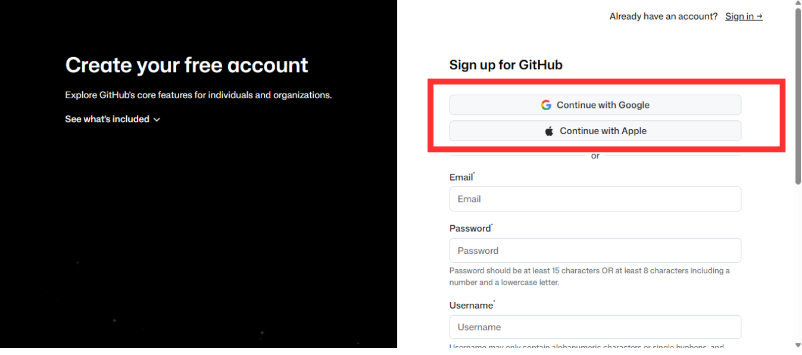
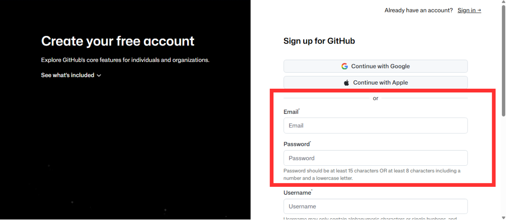
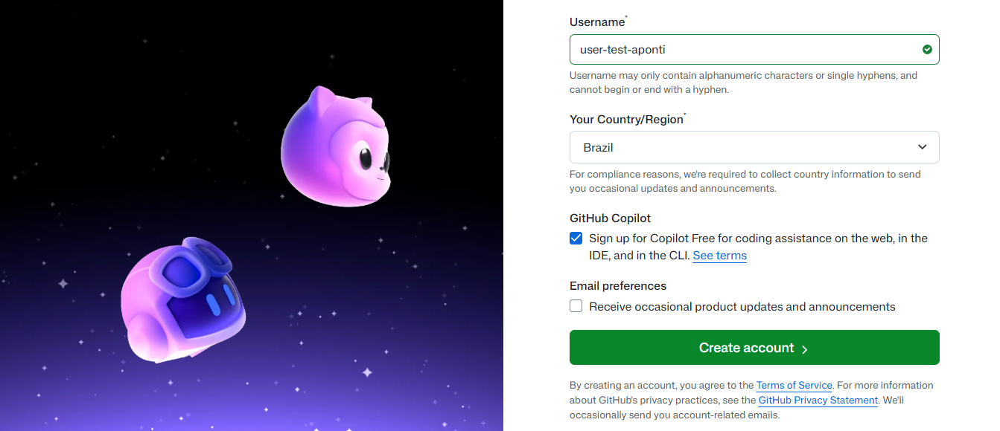

# Como criar uma conta no GitHub

<p align="center">
  
</p>

## 1. Acesse o site

Entre no site oficial do GitHub:

> https://github.com

<p align="center">
  
</p>


## 2. Clique em **Create un account** para iniciar o cadastro.

<p align="center">
  
</p>

---

## 3. Informe sua conta da Google ou a conta da Apple. Os seus dados fornecidos nelas serão reutilizados pelo GitHub e a conta será criada automaticamente.

<p align="center">
  
</p>

Caso você não utilize uma conta da Google ou da Apple, digite outro **endereço de e-mail**:

<p align="center">
  
</p>


> **Observação:** utilize um e-mail que você tenha acesso, pois será necessário confirmar o cadastro.


## Crie uma senha

Escolha uma senha forte, contendo:

* Letras maiúsculas e minúsculas;
* Números;
* Caracteres especiais.

---

## 4. Escolha um nome de usuário (username)

<p align="center">
  
</p>

> Na seta verde defina um username exclusivo para sua conta. Lembre que esse username é como você é identificado na plataforma do GitHub, então escolha com sabedoria pensando no ambiente profissional que você estará inserido.

Exemplos de username:

```text
dev-alexandre
julianatech
roberto-ti
marcostecnologia
```
O GitHub informará se o nome escolhido está disponível.

>Exemplo:

<p align="center">
  
</p>

Após o cadastro, seu perfil poderá ser acessado por um endereço semelhante a:

```text
https://github.com/seu-usuario
```

> Na seta amarela selecione seu país de origem.
> Na seta vermelha marque caso deseje ser notificado sobre as atualizações do GitHub.

---

## 5. Verifique sua conta

O GitHub enviará um código de verificação para o e-mail informado.

1. Acesse sua caixa de entrada;
2. Copie o código recebido;
3. Digite o código na página de verificação do GitHub.

---

## 6. Finalize o cadastro

Após confirmar o e-mail, sua conta estará criada e pronta para uso.

---

# Configurando seu perfil

Após acessar sua conta:

1. Clique na foto de perfil no canto superior direito;
2. Selecione **Your profile**;
3. Clique em **Edit profile**.

Você pode adicionar:

* Foto de perfil;
* Nome;
* Biografia;
* Localização;
* Links para redes profissionais.

Exemplo de biografia:

```text
Estudante de Análise e Desenvolvimento de Sistemas
Java | Spring Boot | AWS
```

---

