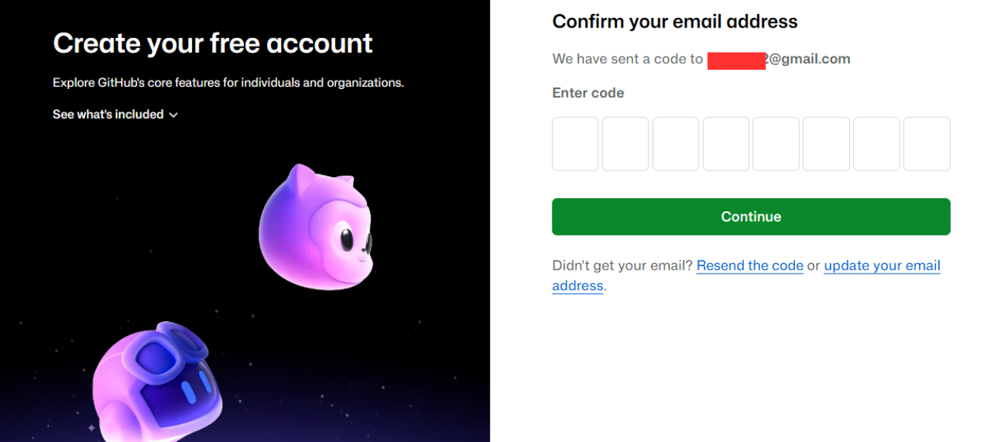
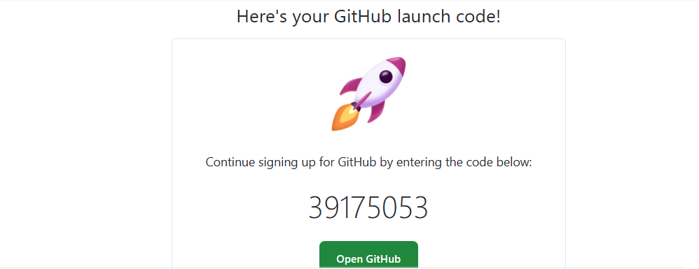
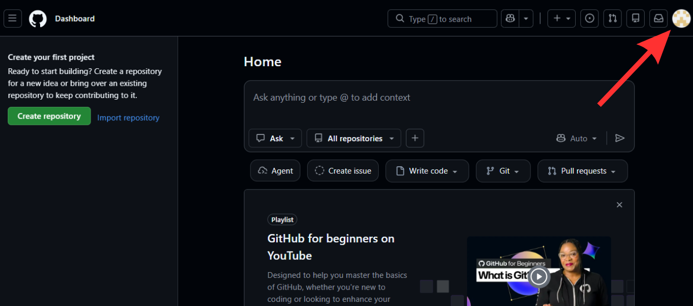
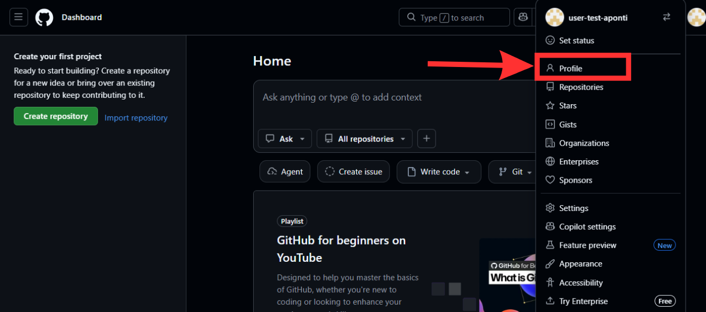
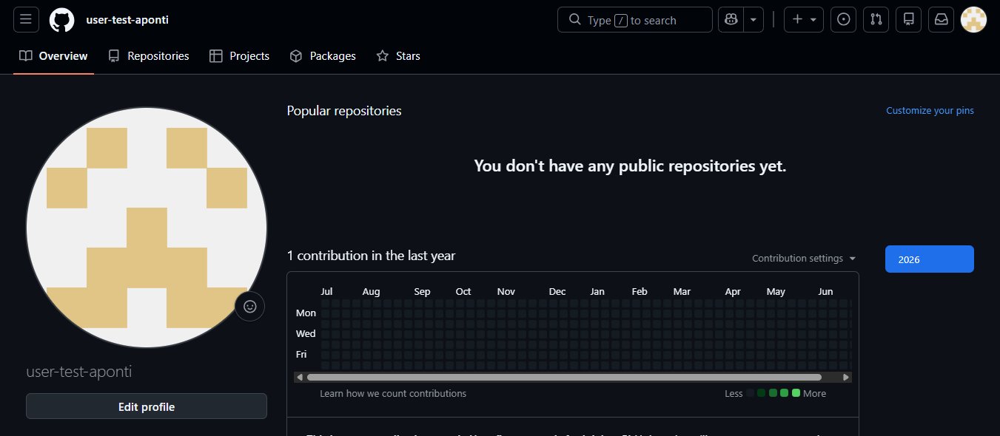
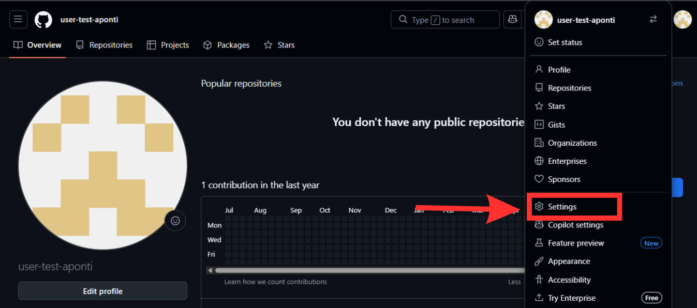
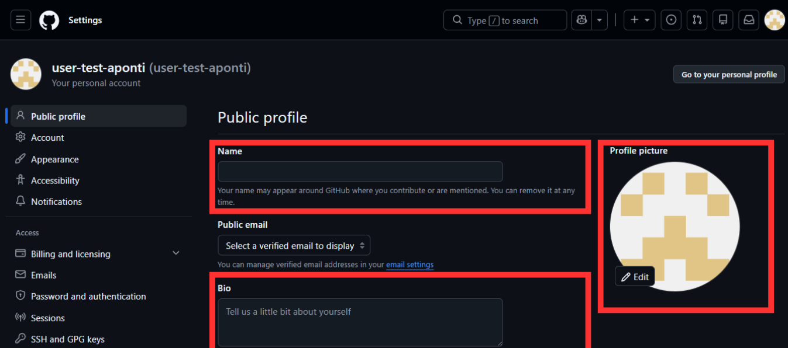

# Como criar uma conta no GitHub

<p align="center">
  
</p>

## 1. Acesse o site

Entre no site oficial do GitHub:

> https://github.com

<p align="center">
  
</p>


## 2. Clique em **Create an account** para iniciar o cadastro.

<p align="center">
  
</p>

---

## 3. Escolha uma das opções de cadastro

Você pode criar sua conta utilizando:

- Uma conta Google;
- Uma conta Apple.

Os dados da conta escolhida serão reutilizados pelo GitHub e sua conta será criada automaticamente.

<p align="center">
  
</p>

Caso você não utilize uma conta da Google ou da Apple, digite outro **endereço de e-mail**:

<p align="center">
  
</p>


> **Observação:** utilize um e-mail que você tenha acesso, pois será necessário confirmar o cadastro.


## 4. Crie uma senha

Escolha uma senha forte, contendo:

* Letras maiúsculas e minúsculas;
* Números;
* Caracteres especiais.

---

## 5. Escolha um nome de usuário (username)

<p align="center">
  
</p>

> Na seta verde defina um username exclusivo para sua conta. Lembre que esse username é como você é identificado na plataforma do GitHub, então escolha com sabedoria pensando no ambiente profissional que você estará inserido.

Exemplos de username:

```text
dev-alexandre
julianatech
roberto-ti
marcostecnologia
```
O GitHub informará se o nome escolhido está disponível.

>Exemplo:

<p align="center">
  
</p>

Após o cadastro, seu perfil poderá ser acessado por um endereço semelhante a:

```text
https://github.com/seu-usuario
```

> Na seta amarela selecione seu país de origem.
> Na seta vermelha marque caso deseje ser notificado sobre as atualizações do GitHub.

---

## 6. Verifique sua conta

O GitHub enviará um código de verificação para o e-mail informado.

I. Acesse sua caixa de entrada;

<p align="center">
  
</p>

II. Copie o código recebido;

<p align="center">
  
</p>
  
III. Após digitar o código na página de verificação do GitHub, abrir a página de login e preencher com o seu username escolhido e a senha, ficará assim:

<p align="center">
  
</p>

---

## 7. Finalize o cadastro

Após confirmar o e-mail, sua conta estará criada e pronta para uso.

---

# Configurando seu perfil:

Após acessar sua conta:

1. Clique na foto de perfil no canto superior direito;

<p align="center">
  
</p>
  
3. Selecione **Your profile**:

<p align="center">
  
</p>

4. Aparecerá assim:

<p align="center">
  
</p>

5. Clique na foto de perfil no canto superior direito e selecione a opção **Settings**:

<p align="center">
  
</p>

6. Aparecerá assim:

<p align="center">
  
</p>

Você pode adicionar:

* Foto de perfil;
* Nome;
* Biografia;
* Localização;
* Links para redes profissionais.

Exemplo de biografia:

```text
Estudante de Análise e Desenvolvimento de Sistemas
Java | Spring Boot | AWS
```

---

