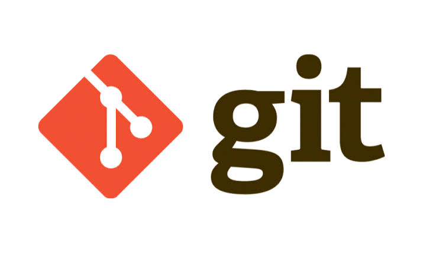

# O que é Git?

<p align="center">
  
</p>

O **Git** é um sistema de controle de versão distribuído, criado por **Linus Torvalds** em 2005. Ele permite registrar, acompanhar e gerenciar as alterações realizadas em arquivos e projetos ao longo do tempo.

Com o Git, é possível manter um histórico completo das modificações, trabalhar em diferentes versões do mesmo projeto por meio de *branches* e colaborar com outros desenvolvedores de forma organizada e segura.

Como é um sistema distribuído, cada desenvolvedor possui uma cópia completa do repositório em seu computador, incluindo todo o histórico de versões.

---

## Principais funcionalidades

| Funcionalidade | Descrição |
|----------------|-----------|
| Controle de versões | Mantém o histórico das alterações do projeto. |
| Branches | Permite desenvolver funcionalidades separadamente. |
| Commits | Registra as alterações realizadas. |
| Merge | Une alterações de diferentes branches. |
| Reversão | Recupera versões anteriores do projeto. |
| Colaboração | Facilita o trabalho em equipe. |

## Exemplo de uso

Imagine que uma equipe está desenvolvendo um site. Cada integrante cria uma *branch* para desenvolver uma funcionalidade específica, como a página inicial ou o sistema de login. Após concluir o desenvolvimento, as alterações são registradas com um *commit* e, posteriormente, integradas à branch principal.

### Fluxo básico do Git

```text
git clone ou git init
        │
        ▼
Criar uma branch
        │
        ▼
Editar arquivos
        │
        ▼
git add
        │
        ▼
git commit
        │
        ▼
git push
```

## Vantagens do Git

- Histórico completo de alterações.
- Trabalho colaborativo eficiente.
- Facilidade para identificar e corrigir erros.
- Segurança por meio do controle de versões.
- Organização do desenvolvimento em equipes.

> 💡 **Importante:** O Git funciona localmente no computador do desenvolvedor. Para compartilhar o projeto com outras pessoas, normalmente utiliza-se o GitHub.

## Resumo

> **Git** é um sistema de controle de versão que permite registrar, acompanhar e gerenciar as alterações realizadas em um projeto, facilitando o desenvolvimento individual e colaborativo.
