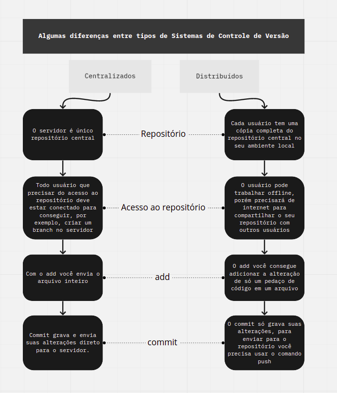

# O que é controle de versão?

O **controle de versão** é o processo de registrar, acompanhar e gerenciar todas as alterações realizadas em um arquivo ou projeto ao longo do tempo. Ele permite que desenvolvedores mantenham um histórico completo das modificações, identifiquem quem realizou cada alteração e recuperem versões anteriores quando necessário.

Em projetos de desenvolvimento de software, o controle de versão é essencial para organizar o trabalho em equipe, evitando que alterações sejam perdidas ou sobrescritas. Ferramentas como o **Git** permitem que vários desenvolvedores trabalhem simultaneamente no mesmo projeto por meio de *branches*, integrando posteriormente as alterações de forma segura.

## Principais benefícios

- Mantém o histórico completo das alterações.
- Facilita o trabalho colaborativo entre equipes.
- Permite criar diferentes versões do projeto por meio de *branches*.
- Possibilita restaurar versões anteriores quando necessário.
- Identifica quem realizou cada alteração e quando ela foi feita.

## Exemplo prático

Imagine que uma equipe está desenvolvendo um sistema. Um integrante cria uma nova funcionalidade enquanto outro corrige um erro. Com o controle de versão, cada um trabalha em sua própria *branch*, registrando suas alterações sem interferir no trabalho do outro. Depois, essas alterações podem ser reunidas no projeto principal.

# Tipos de controle de versão

<p align="center">
  
</p>

>Os sistemas de controle de versão podem ser classificados em dois tipos principais: **centralizado** e **distribuído**.

## 1. Controle de versão centralizado (CVCS)

> No controle de versão centralizado, existe um **único servidor central** que armazena todos os arquivos e o histórico de alterações. Os desenvolvedores acessam esse servidor para enviar e receber modificações.

### Características

- Um único repositório central.
- Dependência do servidor para acessar o histórico.
- Facilita o gerenciamento por um administrador.
- Se o servidor ficar indisponível, o trabalho da equipe pode ser interrompido.

### Exemplos

- CVS (Concurrent Versions System)
- Subversion (SVN)

---

## 2. Controle de versão distribuído (DVCS)

> No controle de versão distribuído, cada desenvolvedor possui uma **cópia completa do repositório**, incluindo todo o histórico de alterações. Assim, é possível trabalhar mesmo sem conexão com a internet e sincronizar as mudanças posteriormente.

### Características

- Cada desenvolvedor possui um repositório completo.
- Permite trabalhar offline.
- Maior segurança, pois existem várias cópias do histórico.
- Facilita o trabalho colaborativo.

### Exemplos

- Git
- Mercurial
- Bazaar

---

## Comparação

| Controle Centralizado | Controle Distribuído |
|------------------------|----------------------|
| Possui um único servidor central. | Cada desenvolvedor possui uma cópia completa do repositório. |
| Depende do servidor para acessar o histórico. | Permite trabalhar offline. |
| Maior risco caso o servidor falhe. | Maior segurança, pois existem várias cópias do projeto. |
| Exemplo: SVN. | Exemplo: Git. |

## Qual tipo o Git utiliza?

O **Git** é um **sistema de controle de versão distribuído (DVCS)**. Isso significa que cada desenvolvedor possui uma cópia completa do repositório em seu computador, podendo registrar alterações, criar *branches* e consultar o histórico mesmo sem acesso à internet.

> **Resumo:** Os sistemas de controle de versão podem ser **centralizados** ou **distribuídos**. O Git pertence à categoria dos sistemas distribuídos, oferecendo maior flexibilidade, segurança e colaboração entre desenvolvedores.

## Resumo

> **Controle de versão** é o processo de registrar e gerenciar as alterações realizadas em um projeto, permitindo acompanhar seu histórico, colaborar com outras pessoas e recuperar versões anteriores de forma segura.

### Exemplo de fluxo

```text
Versão 1 → Versão 2 → Versão 3 → Versão 4
     │          │          │
 Histórico de todas as alterações
```
